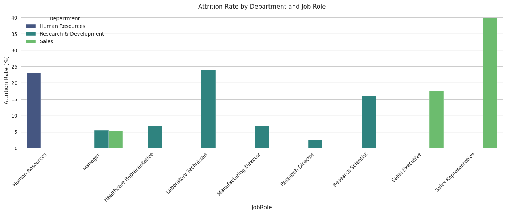
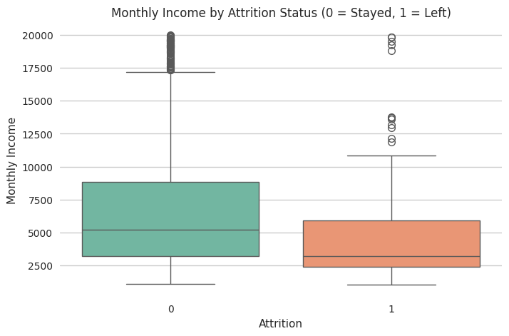
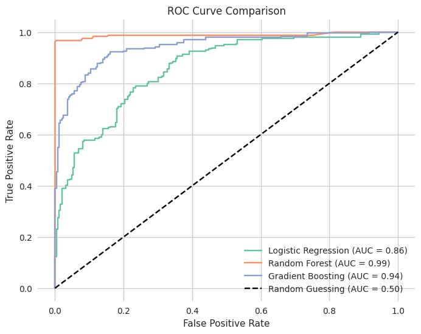
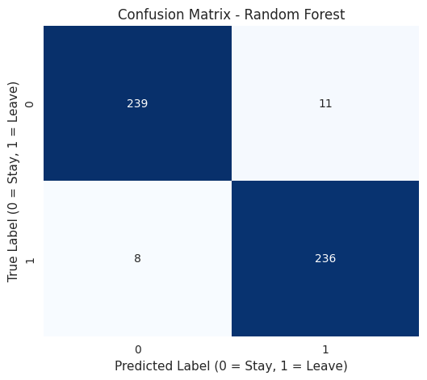
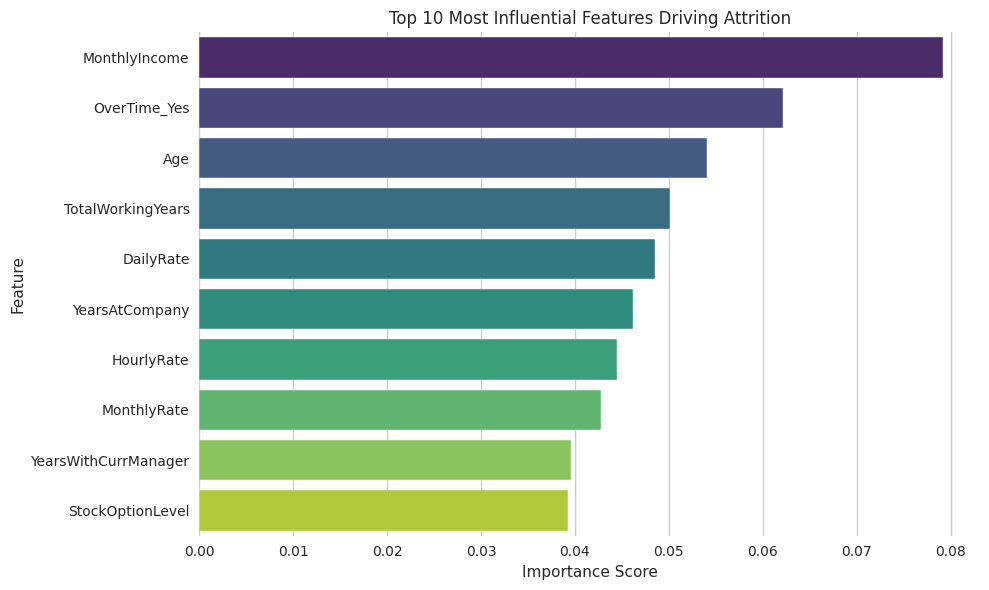

# Employee Attrition Prediction

## The Problem
Every company loses employees—but losing the wrong employees at the wrong time costs businesses heavily in hiring, training, and lost productivity. When top talent walks out the door, it doesn't just hurt the bottom line; it severely disrupts team momentum and institutional knowledge.

HR departments at large companies spend millions every year trying to figure out who is likely to leave and why, preferably *before* it happens. This is known as Employee Attrition Prediction. 

The goal of this project is to build a Machine Learning system that can predict whether an employee is a "flight risk" based on various workplace factors like their job satisfaction, salary, work-life balance, years at the company, and performance ratings. By identifying the root causes of attrition, HR teams can stop guessing and start proactively stepping in to save their best employees.

## Project Workflow
This repository contains an end-to-end data science workflow designed to clean raw HR data, handle heavy class imbalances, and train classification models to predict employee turnover. 

### Step 1: Exploratory Data Analysis (EDA)
Before building any models, I visualized the data to uncover hidden trends behind why people quit. 

<!-- Upload your "Attrition by Department" or "Job Role" Bar Chart to GitHub and replace the path below -->

<!-- Upload your "Monthly Income vs Attrition" Boxplot to GitHub and replace the path below -->

### Step 2: Data Cleaning & Preprocessing
- **Cleaning:** Dropped irrelevant columns (like Employee IDs and Standard Hours) and checked for missing values.
- **Encoding:** Converted categorical variables (like Job Role and Department) into numerical data using One-Hot Encoding (`pd.get_dummies`).
- **Scaling:** Applied `StandardScaler` to ensure large numbers (like salary) didn't overpower smaller numbers (like years at the company).

### Step 3: Handling Imbalanced Data
In this dataset, 84% of employees stayed and only 16% left. If we trained a model on this raw data, it would become biased and simply guess "Stay" every time. To fix this, I used `RandomOverSampler` from the `imblearn` library to randomly duplicate the minority class until the dataset was perfectly balanced (50/50).

### Step 4: Model Training & Evaluation
I trained and compared three different classification algorithms to see which performed best on the balanced data:
- **Logistic Regression** (Baseline)
- **Gradient Boosting**
- **Random Forest Classifier** (Best Performing Model)

Instead of just looking at accuracy, I evaluated the models using **Precision, Recall, F1-Score, and ROC-AUC** to ensure they were actually catching the employees who were leaving.

<!-- Upload your ROC Curve plot to GitHub and replace the path below -->

<!-- Upload your 3-Model Confusion Matrix grid to GitHub and replace the path below -->

## Key Insights & Feature Importance
After training the Random Forest model, I extracted the "Feature Importances" to see exactly what the algorithm learned. 

<!-- Upload your Feature Importance Bar Plot to GitHub and replace the path below -->

The data revealed a few major realities about why people leave:
1. **Money is the Biggest Driver:** Monthly income is the absolute strongest predictor of turnover. If compensation isn't competitive, employees will eventually look elsewhere.
2. **The Burnout Factor:** Overtime is the second biggest trigger. Constant extra hours create a level of burnout that easily overrides a decent paycheck.
3. **The 2-to-5 Year Danger Zone:** Employees are highly vulnerable to leaving during their early tenure (years 2 to 5). If they survive past year 5, retention rates skyrocket.
4. **Sales is Struggling:** The Sales Department, specifically Sales Representatives, experiences the highest churn rate across the company by a massive margin (~40%).

## Tech Stack
- **Python** (Pandas, NumPy)
- **Scikit-Learn** (Machine Learning models and metrics)
- **Imbalanced-Learn** (RandomOverSampler for skewed data)
- **Matplotlib & Seaborn** (Data visualization)

## How to Run
1. Clone this repository.
2. Ensure you have the `HR_Attrition.csv` dataset in the root directory.
3. Open the Jupyter Notebook and run it cell by cell to walk through the EDA, preprocessing, model training, and evaluation steps.
